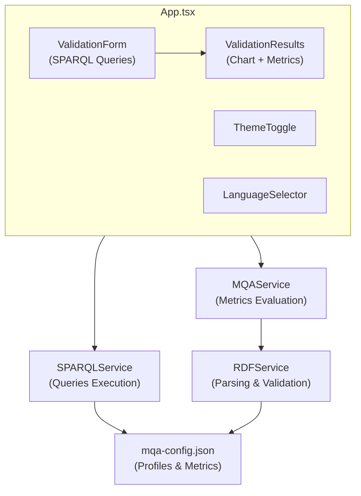

# Metadata Quality Assessment Tool - React App

> [!TIP]
> **Live Demo**: [https://mjanez.github.io/metadata-quality-stack/](https://mjanez.github.io/metadata-quality-stack/)

A modern web application for evaluating RDF metadata quality based on FAIR+C principles, built with [React](https://es.react.dev/) + TypeScript.

## Features

- **Complete MQA evaluation** with real metrics for DCAT-AP, DCAT-AP-ES and NTI-RISP
- **Multi-format support** RDF/XML, Turtle, JSON-LD, N-Triples with auto-detection
- **Remote URL processing** to validate online datasets
- **SPARQL endpoint integration** with predefined queries for data portals
- **Interactive visualization** with FAIR+C radar charts and detailed tables
- **Controlled vocabularies** integrated (formats, licenses, access rights)
- **Responsive interface** with Bootstrap 5 and modern components
- **Full TypeScript** for safe and maintainable development
- **Internationalization** English/Spanish support with react-i18next
- **Dark/Light themes** with user preference persistence
- **Tabbed results** keeping original form visible during validation
- **Accordion metrics** grouped by FAIR+C dimensions

## Table of Contents

- [Tech Stack](#-tech-stack)
- [Quick Start](#-quick-start)
- [Configuration](#-configuration)
  - [MQA Profiles](#mqa-profiles)
  - [Quality Metrics](#quality-metrics)
  - [SPARQL Configuration](#sparql-configuration)
- [Development](#-development)
- [Deployment](#-deployment)
- [Architecture](#-architecture)
- [Internationalization](#-internationalization)
- [Theming](#-theming)
- [Troubleshooting](#-troubleshooting)

## Tech Stack

| Technology | Version | Purpose |
|------------|---------|---------|
| [**React**](https://github.com/facebook/react) | 19.1.1 | UI framework with modern hooks |
| [**TypeScript**](https://github.com/microsoft/TypeScript) | 4.9.5 | Static typing and safe development |
| [**N3.js**](https://github.com/rdfjs/N3.js) | 1.26.0 | RDF parsing and manipulation |
| [**rdfxml-streaming-parser**](https://github.com/rdfjs/rdfxml-streaming-parser.js) | 3.1.0 | RDF/XML → Turtle conversion |
| [**shacl-engine**](https://github.com/rdf-ext/shacl-engine) | 1.0.2 | A fast RDF/JS SHACL engine includes SHACL SPARQL-based Constraints |
| [**Bootstrap**](https://github.com/twbs/bootstrap) | 5.3.7 | Responsive CSS framework |
| [**Chart.js**](https://github.com/chartjs/Chart.js) | 4.5.0 | Radar charts visualization |
| [**react-i18next**](https://github.com/i18next/react-i18next) | Latest | Internationalization support |
| [**gh-pages**](https://github.com/tschaub/gh-pages) | 6.3.0 | Automated GitHub Pages deployment |

## Quick Start

### Prerequisites
```bash
Node.js >= 16.x
npm >= 8.x
```

### Installation
```bash
# Clone repository
git clone https://github.com/mjanez/metadata-quality-stack.git
cd metadata-quality-stack/react-app

# Install dependencies
npm install

# Start development server
npm start
```

Application will be available at: **http://localhost:3000**

## Configuration

The application is configured through the `src/config/mqa-config.json` file, which centralizes all settings for profiles, metrics, and SPARQL endpoints. This configuration file follows a structured approach to support multiple metadata standards and quality assessment methodologies.

### MQA Profiles

Profiles define the metadata standards (DCAT-AP, DCAT-AP-ES, NTI-RISP) with their specific versions and validation rules.

#### Profile Structure

```json
{
  "profiles": {
    "profile_id": {
      "versions": {
        "version_number": {
          "name": "Display Name",
          "maxScore": 405,
          "icon": "img/icons/icon.svg",
          "url": "https://profile-documentation-url",
          "sampleUrl": "https://sample-data-url",
          "shaclFiles": [
            "https://shacl-validation-file-1.ttl",
            "https://shacl-validation-file-2.ttl"
          ],
          "dimensions": {
            "findability": { "maxScore": 100 },
            "accessibility": { "maxScore": 100 },
            "interoperability": { "maxScore": 110 },
            "reusability": { "maxScore": 75 },
            "contextuality": { "maxScore": 20 }
          }
        }
      },
      "defaultVersion": "version_number"
    }
  }
}
```

#### Adding a New Profile

1. **Create the profile structure** in `mqa-config.json`:
```json
"my_custom_profile": {
  "versions": {
    "1.0.0": {
      "name": "My Custom Profile 1.0.0",
      "maxScore": 400,
      "icon": "img/icons/custom.svg",
      "url": "https://my-profile-docs.com",
      "sampleUrl": "https://my-sample-data.ttl",
      "shaclFiles": [
        "https://my-shacl-validation.ttl"
      ],
      "dimensions": {
        "findability": { "maxScore": 100 },
        "accessibility": { "maxScore": 100 },
        "interoperability": { "maxScore": 100 },
        "reusability": { "maxScore": 75 },
        "contextuality": { "maxScore": 25 }
      }
    }
  },
  "defaultVersion": "1.0.0"
}
```

2. **Add corresponding metrics** in the `metricsByProfile` section
3. **Add icon file** to `public/img/icons/`
4. **Update translations** in `public/locales/en/translation.json` and `public/locales/es/translation.json`

### Quality Metrics

Metrics define how quality is measured for each FAIR+C dimension. Each metric has an ID, weight, and associated RDF property.

#### Metric Structure

```json
{
  "metricsByProfile": {
    "profile_id": {
      "dimension_name": [
        {
          "id": "metric_identifier",
          "weight": 30,
          "property": "rdf:property"
        }
      ]
    }
  }
}
```

#### Adding New Metrics

1. **Define the metric** in the appropriate profile and dimension:
```json
"findability": [
  {
    "id": "my_custom_metric",
    "weight": 25,
    "property": "my:customProperty"
  }
]
```

2. **Add metric labels** to translation files:
```json
{
  "metricLabels": {
    "my_custom_metric": "My Custom Metric"
  }
}
```

3. **Implement evaluation logic** in `src/services/MQAService.ts` if needed

#### FAIR+C Dimensions

| Dimension | Code | Description | Typical Metrics |
|-----------|------|-------------|----------------|
| **Findability** | `findability` | How easily the dataset can be found | Keywords, themes, spatial/temporal coverage |
| **Accessibility** | `accessibility` | How accessible the data is | Access URLs, download URLs, status checks |
| **Interoperability** | `interoperability` | Technical interoperability | Formats, media types, standards compliance |
| **Reusability** | `reusability` | How easily the data can be reused | Licenses, access rights, contact information |
| **Contextuality** | `contextuality` | Contextual information provided | Size, dates, rights information |

### SPARQL Configuration

The SPARQL configuration enables integration with data portals and endpoints for automated data retrieval and validation.

#### SPARQL Structure

```json
{
  "sparqlConfig": {
    "defaultEndpoint": "https://sparql-endpoint-url",
    "queries": {
      "profile_id": [
        {
          "id": "query_identifier",
          "name": "Human-readable name",
          "description": "Query description",
          "query": "SPARQL query string with {parameter} placeholders",
          "parameters": [
            {
              "name": "parameter_name",
              "label": "Parameter Label",
              "type": "text",
              "required": true,
              "placeholder": "Enter value...",
              "description": "Parameter description"
            }
          ]
        }
      ]
    }
  }
}
```

#### Adding SPARQL Queries

1. **Define the query** for a specific profile:
```json
"my_profile": [
  {
    "id": "my_custom_query",
    "name": "Custom Data Query",
    "description": "Retrieves custom dataset information",
    "query": "PREFIX dcat: <http://www.w3.org/ns/dcat#>\nCONSTRUCT {\n  ?dataset a dcat:Dataset ;\n    dct:title ?title .\n}\nWHERE {\n  ?dataset a dcat:Dataset ;\n    dct:publisher ?publisher ;\n    dct:title ?title .\n  FILTER (regex(str(?publisher), \"{org_id}\", \"i\"))\n}\nLIMIT {limit}",
    "parameters": [
      {
        "name": "org_id",
        "label": "Organization ID",
        "type": "text",
        "required": true,
        "placeholder": "e.g., ministry-of-health",
        "description": "Identifier of the organization"
      },
      {
        "name": "limit",
        "label": "Result Limit",
        "type": "number",
        "required": false,
        "placeholder": "50",
        "description": "Maximum number of results"
      }
    ]
  }
]
```

2. **Parameter Types Available**:
   - `text`: Text input
   - `number`: Numeric input
   - `select`: Dropdown (requires `options` array)
   - `textarea`: Multi-line text

3. **Query Features**:
   - **Parameter substitution**: Use `{parameter_name}` in queries
   - **CONSTRUCT queries**: Preferred for generating valid RDF
   - **Endpoint testing**: Use debug queries to test connectivity

#### Debug Queries

Special debug queries help test endpoint connectivity:

```json
"debug": [
  {
    "id": "test_endpoint",
    "name": "Test Endpoint",
    "description": "Verify endpoint connectivity",
    "query": "SELECT * WHERE { ?s ?p ?o } LIMIT 10",
    "parameters": []
  }
]
```

### Configuration Best Practices

1. **Profile Naming**: Use consistent IDs (`dcat_ap`, `dcat_ap_es`, `nti_risp`)
2. **Version Management**: Support multiple versions per profile
3. **Metric Weights**: Ensure weights sum to reasonable totals per dimension
4. **SPARQL Queries**: Use CONSTRUCT queries for better RDF generation
5. **Parameter Validation**: Provide clear descriptions and examples
6. **Icon Management**: Store icons in `public/img/icons/` as SVG
7. **Translation Keys**: Keep metric IDs consistent across profiles

## Development

| Script | Command | Description |
|--------|---------|-------------|
| **Development** | `npm start` | Local server with hot reload |
| **Build** | `npm run build` | Optimized production build |
| **Deploy** | `npm run deploy` | Automatic deploy to GitHub Pages |
| **Test** | `npm test` | Run tests (if any) |

### File Structure

```
react-app/
├── public/
│   ├── data/                    # JSONL vocabularies
│   │   ├── access_rights.jsonl
│   │   ├── file_types.jsonl
│   │   ├── licenses.jsonl
│   │   └── ...
│   ├── locales/                 # i18n translations
│   │   ├── en/translation.json  # English translations + metricLabels
│   │   └── es/translation.json  # Spanish translations + metricLabels
│   └── img/icons/               # Profile icons
├── src/
│   ├── components/              # React components
│   │   ├── ValidationForm.tsx   # Input form + SPARQL integration
│   │   ├── ValidationResults.tsx # Results and charts
│   │   ├── QualityChart.tsx     # FAIR+C radar chart
│   │   └── ...
│   ├── services/                # Business logic
│   │   ├── MQAService.ts        # Main MQA engine + metric evaluation
│   │   ├── SPARQLService.ts     # SPARQL endpoint integration
│   │   └── RDFService.ts        # RDF processing
│   ├── config/                  # Configuration
│   │   └── mqa-config.json      # **Central configuration file**
│   ├── types/                   # TypeScript types
│   └── i18n/                    # Internationalization setup
└── package.json
```

## Deployment

### Automatic Deploy
```bash
# Build + Deploy in one command
npm run deploy
```

### Manual Deploy
```bash
# 1. Production build
npm run build

# 2. Manual deploy
npx gh-pages -d build
```

## Architecture

### Component Overview


### Data Flow

1. **Configuration Loading**: `mqa-config.json` → Services
2. **User Input**: Form data → ValidationForm
3. **SPARQL Integration**: Queries → SPARQLService → RDF data
4. **RDF Processing**: Raw data → RDFService → Parsed triples
5. **Quality Assessment**: Triples → MQAService → Metrics scores
6. **Visualization**: Scores → Chart components → User interface

### Supported Profiles

- **DCAT-AP 2.1.1**: 405 maximum points
- **DCAT-AP 3.0.0**: 405 maximum points  
- **DCAT-AP-ES 1.0.0**: 405 maximum points
- **NTI-RISP 2013**: 305 maximum points

### FAIR+C Quality Model
| Dimension | Description |
|-----------|-------------|
| **F** - Findability | Ease of finding the dataset |
| **A** - Accessibility | Data accessibility |
| **I** - Interoperability | Technical interoperability |
| **R** - Reusability | Ease of reuse |
| **C** - Contextuality | Contextual information |

## Internationalization

### Languages Supported
- **English** (default)
- **Spanish** (Español)

### Adding New Languages
1. Create translation file in `public/locales/{lang}/translation.json`
2. Add language option to `LanguageSelector` component
3. Update i18n configuration in `src/i18n/index.ts`

### Translation Structure

Translation files in `public/locales/{lang}/translation.json` include both UI labels and metric definitions:

```json
{
  "common": {
    "title": "Metadata Quality Assessment",
    "loading": "Loading...",
    "validate": "Validate"
  },
  "dimensions": {
    "findability": "Findability",
    "accessibility": "Accessibility",
    "interoperability": "Interoperability", 
    "reusability": "Reusability",
    "contextuality": "Contextuality"
  },
  "metricLabels": {
    "dcat_keyword": "Keywords (dcat:keyword)",
    "dcat_theme": "Themes (dcat:theme)",
    "dct_format": "Format (dct:format)",
    "dct_license": "License (dct:license)"
  }
}
```

The `metricLabels` section contains all quality metric translations and is integrated with the MQA evaluation system.

## Theming
### Customizing Styles
Edit these files:
- `src/App.css` - Main application styles
- `src/components/*.css` - Component-specific styles
- Bootstrap variables can be overridden in CSS

### Theme Variables
```css
:root {
  --bs-primary: #0d6efd;
  --mqa-chart-bg: #ffffff;
  --mqa-text-color: #212529;
}

[data-bs-theme="dark"] {
  --mqa-chart-bg: #212529;
  --mqa-text-color: #ffffff;
}
```

### Vocabulary Data

Controlled vocabularies are stored in `public/data/` as JSONL files for efficient loading:

| File | Purpose | Usage |
|------|---------|-------|
| `access_rights.jsonl` | Access rights vocabulary | License validation |
| `file_types.jsonl` | File format types | Format classification |
| `licenses.jsonl` | License definitions | License compliance |
| `machine_readable.jsonl` | Machine-readable formats | Interoperability metrics |
| `media_types.jsonl` | MIME media types | Format validation |
| `non_proprietary.jsonl` | Non-proprietary formats | Openness assessment |

#### Updating Vocabularies

```bash
# Convert CSV vocabularies to JSONL format
python3 scripts/vocabs_csv2jsonl.py
```

## Troubleshooting

### Build Errors
```bash
# Clear cache
rm -rf node_modules/.cache
npm run build
```

### Type Errors
```bash
# Check types without build
npx tsc --noEmit
```

### Deploy Issues
```bash
# Check gh-pages branch
git checkout gh-pages
git log --oneline -5

# Force redeploy
npm run deploy -- --force
```

### i18n Issues
```bash
# Check translation files
cat public/locales/en/translation.json
cat public/locales/es/translation.json
```

### Configuration Issues

```bash
# Validate mqa-config.json syntax
npm run build 2>&1 | grep -i "config\|json"

# Check for missing metric labels
grep -r "metricLabels" public/locales/
```

### Performance Issues

```bash
# Analyze bundle size
npm run build && npx webpack-bundle-analyzer build/static/js/*.js

# Check for memory leaks in development
npm start -- --profile
```

## Contributing

### Adding New Features

1. **New Profile Support**:
   - Update `mqa-config.json` with profile definition
   - Add SHACL validation files
   - Create profile icon in `public/img/icons/`
   - Add translations for profile name and metrics

2. **New Quality Metrics**:
   - Define metric in `metricsByProfile` section
   - Implement evaluation logic in `MQAService.ts`
   - Add metric labels to translation files
   - Update documentation

3. **SPARQL Queries**:
   - Add queries to `sparqlConfig.queries`
   - Test with debug queries first
   - Document parameter usage
   - Provide sample data URLs

### Code Standards

- **TypeScript**: Strict mode enabled, no `any` types
- **React**: Functional components with hooks
- **CSS**: Bootstrap 5 + custom CSS variables
- **i18n**: All user-facing text must be translatable
- **Testing**: Add tests for new services and components

## License

This project is licensed under the MIT License. See the [LICENSE](../LICENSE) file for details.

---

**Built with ❤️ for the open data community**
